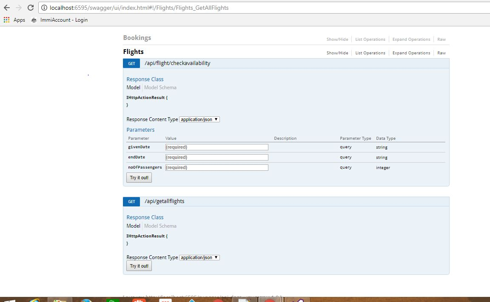
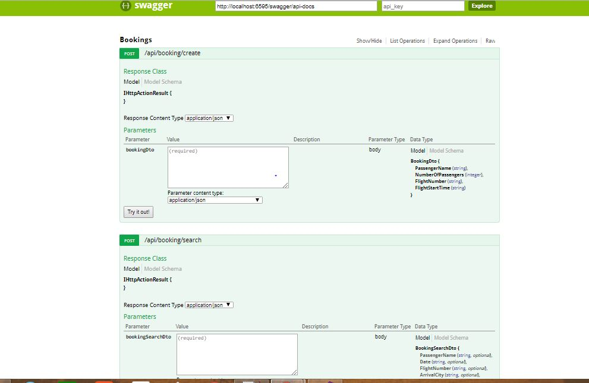

# Cognology Flight Booking Application 

Create a Rest API which facilitates the below functionality:

1. **List all flights**:
Flight no, start time, end time, passenger capacity, departer city, arrival city

2. **Search for bookings**:
By passenger name, date, arrival city, departure city, flight number

3. **Check availability** :
By giving start and end Date. No of passengers

4. **Make booking**:
By selecting flights and providing passenger details

Sample JSON requests for each operation should be included in the solution. There should be flights loaded into the database so that the solution can be tested.
You may use any database or mechanism to store the data. However please note that the solution should able to be executed without installing any additional software to visual studio.

# Implementation

This solution is implemented using MVC5 application with **Web API 2 and Entity framework code first** workflow. In-order, to test the API, **swagger [api testing tool]** is integrated with the solution which also provides details about the API documentation. I have also used **automapper** to map the entities with their respective data transfer objects(DTO).

1. **Controllers/api** holds the web api controllers [BookingsController and FlightsController]
 
2. **Models** contains the entity classes
 
3. **Dto** contains the data transfer objects that would be returned to the client


# Future Improvements

1. Input validation framework in web API for handling all corner cases
2. Some logic can be moved from the API to a repository level to ensure better code segregation and readability

# How to test ?

One of the most powerful api testing tool, Swagger, has been integrated to the solution. Below are the steps to demonstrate how an API can be tested on the fly within the application.

### 1. GetAllFlights:

1. Upon running the solution locally, you would notice that the local host is running on a specific port for ex. http://localhost:6595

2. Now try to launch swagger by appending "/swagger" to the url i.e. http://localhost:6595/swagger. You would notice the below screen:

![Output] (./Output/swagger_launch.jpg)

3. Upon clicking on Flights, you would notice both the API's exposed by the FlightsController. Now, click on **/api/getallflights**. You will see the below screen:

![Output] (./Output/get_all_flights.jpg)

4. Click on the **Try It Out** button and check the response

![Output] (./Output/response.jpg)

Similarly, other API's can also be tested.


### 2. Check Availability

**Example data:**


```yml
  givenDate: "3/2/2018 4:00:00 AM"
  endDate: "3/4/2018 9:00:00 AM"
  noOfPassengers: 1
  
  http://localhost:6595/api/flight/checkavailability?givenDate=3%2F2%2F2018%204%3A00%3A00%20AM&endDate=3%2F4%2F2018%209%3A00%3A00%20AM&noOfPassengers=1

  ```

 ![Output] (./Output/check_availability.jpg)

# Instructions

1. Download solution from git repository as zip file

2. Download the Nuget packages

3. Build solution

4. Run the solution and check if localhost is launching


# Result

## Flight API



## Bookings API


